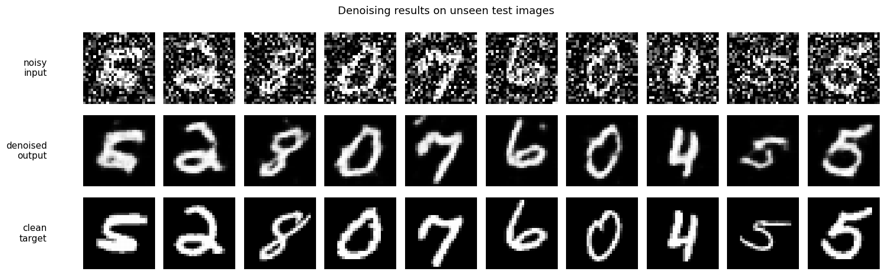
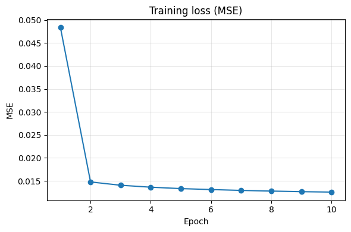
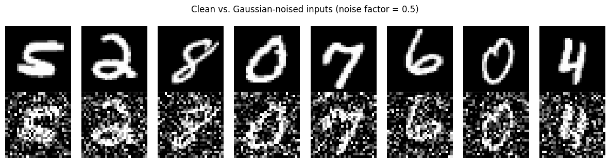

<h1 align="center">🧹 MNIST Denoising Autoencoder</h1>

<p align="center">
  A convolutional <b>denoising autoencoder</b> in PyTorch that removes noise from
  handwritten-digit images — feed it a noisy digit, get back a clean one.
</p>

<p align="center">
  
  
  
  
  
</p>

<p align="center"><i>Week-6 Assessment — Deep Learning (Autoencoders &amp; GANs), Celebal Technologies</i></p>

---

## ✨ Results

The model is shown only **noisy** images at test time and reconstructs clean, readable digits it has never seen.

<p align="center"><b>Noisy input → Denoised output → Clean target</b></p>



After 10 epochs the test reconstruction error is **MSE ≈ 0.012**.

<table>
<tr>
<td width="55%"><b>Training loss</b><br></td>
<td width="45%"><b>Clean vs. noised inputs</b><br></td>
</tr>
</table>

---

## 🧠 How it works

An autoencoder squeezes an image through a small **bottleneck** and rebuilds it. For *denoising*, we feed it a **noisy** image but score the output against the **clean** original — so the network is forced to learn the true structure of each digit (strokes, curves) and discard the random noise.

```
clean digit ──add noise──▶ noisy digit ──▶ [ Encoder → latent → Decoder ] ──▶ denoised digit
                                                                                ▲
                                                          loss compared to the clean digit
```

| Stage | Layers | Shape |
|-------|--------|-------|
| **Encoder** | 2× `Conv2d` (stride 2) + ReLU | `28×28 → 14×14 → 7×7`, channels `1 → 32 → 64` |
| **Decoder** | 2× `ConvTranspose2d` (stride 2) + ReLU, final `Sigmoid` | `7×7 → 14×14 → 28×28`, channels `64 → 32 → 1` |

- **Loss:** Mean Squared Error (reconstruction vs. clean target)
- **Optimizer:** Adam (`lr = 1e-3`) · **Noise:** Gaussian, factor `0.5`, re-sampled every batch
- **~37.5k** trainable parameters

---

## 📂 Dataset

MNIST as PNG images — **60,000 train / 10,000 test** — from Kaggle:
**https://www.kaggle.com/datasets/awsaf49/mnist-dataset**

Download and unzip into a `data/` folder so the layout is:

```
data/mnist_png/training/<0-9>/*.png
data/mnist_png/testing/<0-9>/*.png
```

> The `data/` folder is **git-ignored** — it is not committed, keeping the repo lightweight.

---

## 🚀 Setup & run

```bash
# 1. Install dependencies
pip install -r requirements.txt

# 2. Open the notebook and run all cells
jupyter notebook denoising_autoencoder.ipynb
```

The notebook automatically uses an Apple-Silicon (**MPS**) or **CUDA** GPU if available, otherwise the CPU. Training runs for 10 epochs.

---

## 🗂️ Project structure

```
MNIST-Denoising-Autoencoder/
├── denoising_autoencoder.ipynb   # ⭐ Main notebook — full pipeline with outputs
├── build_notebook.py             # Script that generates the notebook
├── requirements.txt              # Python dependencies
├── assets/                       # Result images used in this README
├── models/                       # Saved model weights (denoising_autoencoder.pth)
└── data/                         # MNIST PNGs (download separately, git-ignored)
```

---

## 🔭 Possible extensions

- Try different noise levels or types (salt-and-pepper, speckle)
- Add batch-norm or a third conv layer for a deeper model
- Swap MSE for an SSIM / perceptual loss for sharper reconstructions
- Compare against a plain fully-connected autoencoder baseline

---

<p align="center"><sub>Built with PyTorch · MNIST · Apple-Silicon MPS</sub></p>
